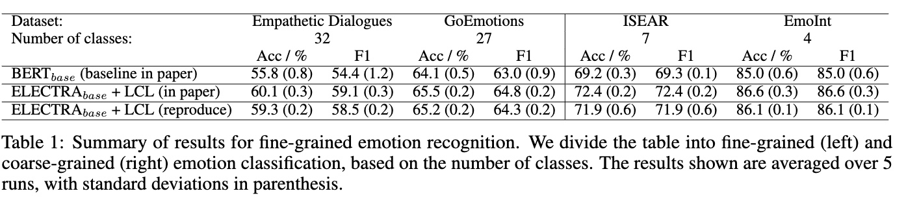
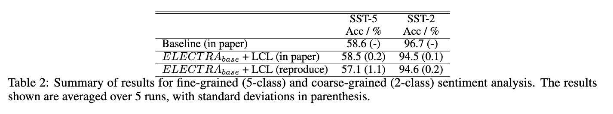
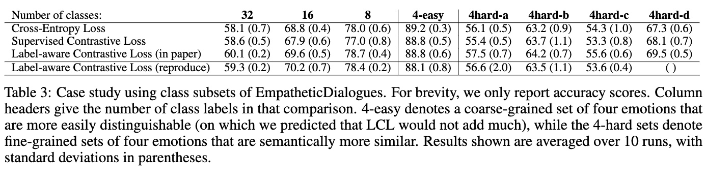

# Label-aware Contrastive Loss

This repo contains the pytorch implementation of Label-aware Contrastive Loss (LCL).

## Dataset preprocess

Download datasets from the given data source
links, [Empathetic Dialogue](https://github.com/facebookresearch/EmpatheticDialogues.git)
, [GoEmotions](https://github.com/google-research/google-research/tree/master/goemotions)
, [ISEAR](https://www.unige.ch/cisa/research/materials-and-online-research/research-material/)
, [EmoInt](https://saifmohammad.com/WebPages/EmotionIntensity-SharedTask.html)
, [SST-2, SST-5](https://nlp.stanford.edu/sentiment/index.html)

For Empathetic Dialogue dataset, an additional extraction of the raw data was done to get the csv files using
ed_data_extract.py which is required for the below pre-processing

```
python data_preprocess.py -d <dataset name> --aug ## for emotion datasets
python sst_data_preprocess.py -d <dataset name> --aug ## for sentiment datasets
```

## Training/Evaluating the model

The training and evaluating happen together. Set the parameters in config.py, and run

```
python train.py
```

#### Parameters

- `--dataset` The dataset for training. Choices from `'ed', 'emoint', 'goemotions', 'isear', 'sst-2', 'sst-5'`.
- `--label_list` Only train and eval on a provided list of labels. See the section below.
- `--run_name` Configure the output folder name.

### Train with label subsets

Change the `label_list` to your designed labels (e.g., `["Anticipating", "Excited", "Hopeful", "Guilty"]`.)

For example, to train a subset of label of `EmpatheticDialogues`, after setting`label_list`, run

```
python train.py --dataset ed --run_name 4-easy --label_list "Angry" "Afraid" "Joyful" "Sad"
```

### Train Baseline

Similar to the training the main model.

```shell
python train_baseline.py
```

#### Rarameters

All params in `train.py` is also available, in addition to

- `--lambda_loss` Valid value in `[0.0, 1.0]`. Used for adjusting the percentage of Cross Entropy in the final loss
  function. Will use the `lambda_loss` in `config.py` if this is not configured.

## Data Subset

Labels for each subset. _Hint_: the following code snippets are copy-paste ready.

### EmpatheticDialogues

16-classes: `["Afraid", "Angry", "Annoyed", "Anxious", "Confident","Disappointed", "Disgusted", "Excited", "Grateful", "Hopeful", "Impressed", "Lonely", "Proud", "Sad", "Surprised", "Terrified"]`

8-classes: `["Angry", "Afraid", "Ashamed", "Disgusted", "Guilty", "Proud", "Sad", "Surprised"]`

4-easy: `["Angry", "Afraid", "Joyful", "Sad"]`

4-hard-a: `["Anxious", "Apprehensive", "Afraid", "Terrified"]`

4-hard-b: `["Devastated", "Nostalgic", "Sad", "Sentimental"]`

4-hard-c: `["Angry", "Ashamed", "Furious", "Guilty"]`

4-hard-d: `["Anticipating", "Excited", "Hopeful", "Guilty"]`

## Results

### Result 1

The proposed method renders SOTA performance on four Emotion Classification datasets.



### Result 2

The proposed method renders performance comparable to SOTA on two Sentiment Classification datasets.



### Result 3

The proposed method outperforms baselines on different subsets of a specific dataset with varying number of classes and
difficulty: the author hypothesized that LCL should do better, compared with other methods, with an increasing number of
classes.



## Credits

We took help from the following open source projects and we acknowledge their contributions.

1. Supervised Contrastive Loss <https://github.com/HobbitLong/SupContrast>
2. SST-tree2tabular <https://github.com/prrao87/fine-grained-sentiment/blob/master/data/sst/tree2tabular.py>

3. Tweet preprocess <https://github.com/cbaziotis/ntua-slp-semeval2018.git>
4. Tweet preprocess <https://github.com/abdulfatir/twitter-sentiment-analysis.git>
